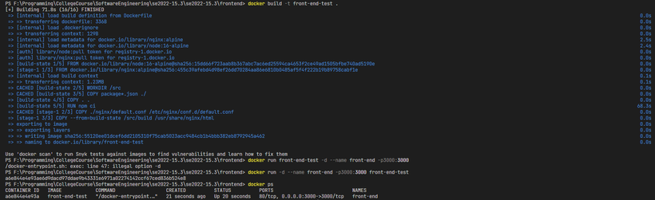
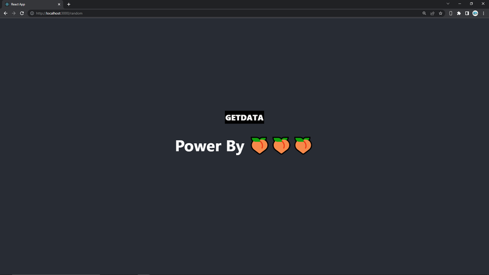
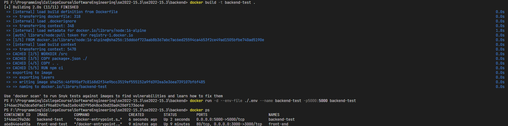
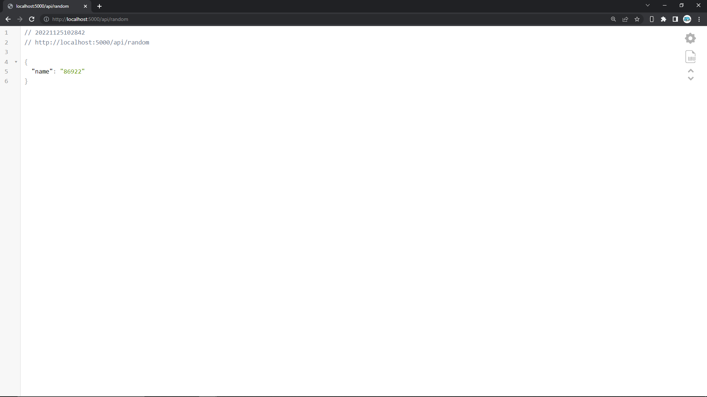
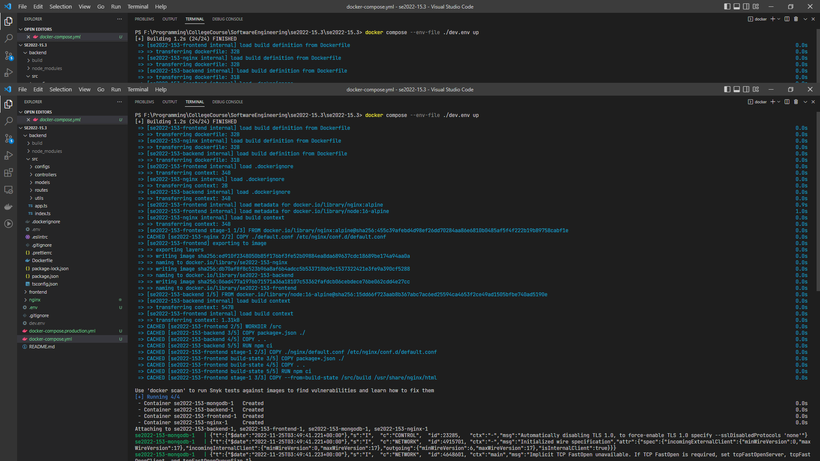
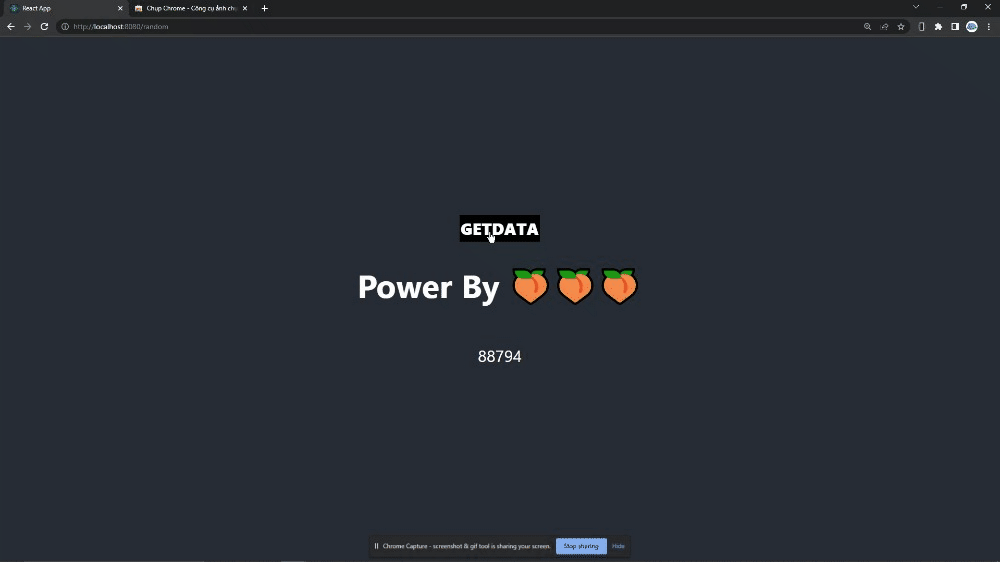

# Báo Cáo Tuần 1

Báo cáo những công việc đã thực hiện được trong tuần đầu tiên.

## Tìm Hiểu Về Docker

- Tìm hiểu được cái khái niệm của docker : Image, Container, Registry, Dockerfile, docker compose, networking trong docker

- Thực hiện build image và chạy container, demo bằng một ứng dụng web đơn giản

  - Cấu trúc câu lệnh build :

  ```bash
  docker build [OPTIONS] PATH | URL | -

  ```

  - Cấu Trúc câu lệnh run :

  ```bash
  docker run [OPTIONS] IMAGE [COMMAND] [ARG...]
  ```

  - Build image và chạy container frontend với [Dockerfile](../frontend/Dockerfile)

    Câu lệnh Build :

    ```bash
    docker build -t front-end-test .
    ```

    - Mô tả các Option :

      - -t : Đặt tên và thêm tag( Không bắt buộc) cho image. Trong câu lênh trên, tên image là **front-end-test** và không có tag
      - [Xem thêm các option khác](https://docs.docker.com/engine/reference/commandline/build/#options)

    <br />
    Câu lệnh run container :

    ```bash
    docker run -d --env-file ./.env --name front-end -p3000:3000 front-end-test
    ```

    - Mô tả các Option :

      - -d : Chạy ngầm container và chỉ in ra id của container
      - --env-file : chỉ định file chứa các biến môi trường
      - --name : Đặt tên cho container
      - -p : mapping port giữa máy thật và máy ảo đang chạy( **host's port** : **container's port** )
      - [Xem thêm các option khác](https://docs.docker.com/engine/reference/commandline/run/#options)

    Kết quả nhận được :

    
    

- build image và chạy container backend với [Dockerfile](../backend/Dockerfile)

  Câu lệnh Build :

  ```bash
  docker build -t backend-test .
  ```

    <br />
    Câu lệnh run container :

  ```bash
  docker run -d --env-file ./.env --name backend-test -p5000:5000 backend-test
  ```

  - Mô tả các Option :

    - Các option tương tự như phần **front-end** ở trên

  Kết quả nhận được :

  
  

- Sử dụng docker compose để chạy nhiều container [docker-compose file](../docker-compose.yml)

  - cấu trúc câu lệnh docker compose :

  ```bash
  docker compose [-f <arg>...] [--profile <name>...] [options] [COMMAND] [ARGS...]
  ```

  - Câu lệnh tạo và chạy các container :

  ```bash
  docker compose --env-file ./dev.env up
  ```

  - Mô tả các Option :

    - --env-file : chỉ địch file chứa các biến môi trường sẽ được sử dụng trong docker-compose file
    - up : tạo và chạy các container

  - Một vài Option phổ biến khác :

    - down : dừng và xóa các container, docker network
    - stop : Dừng các container đang chạy mà không xóa chúng
    - restart : Khởi động lại các container bất kể là dừng hay đang chạy
    - [Xem Thêm](https://docs.docker.com/engine/reference/commandline/compose/)

  <br>
  Kết quả thu được :




Đã có thể gọi api được từ backend.

## Kế Hoạch Cho Các Tuần Tiếp Theo

- Thực hiện deploy thủ công lên server sau đó nghiên cứu github actions để tự động hóa quá trình deploy ([issue #5](https://github.com/quanduongduc/se2022-15.3/issues/5))
- Cả nhóm thống nhất một ứng dụng web thực tế để triển khai.
