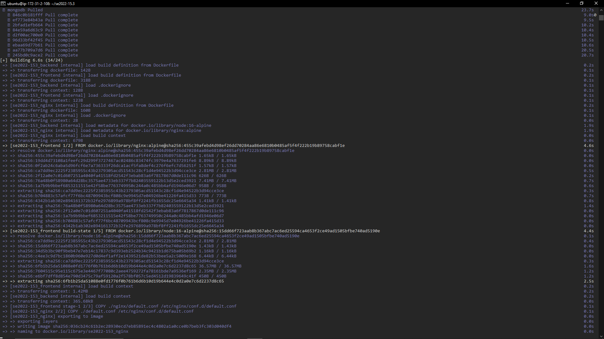
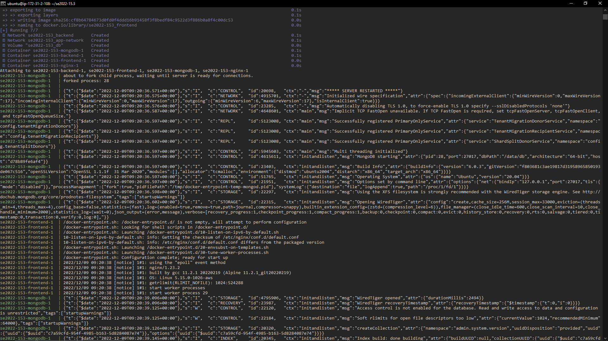
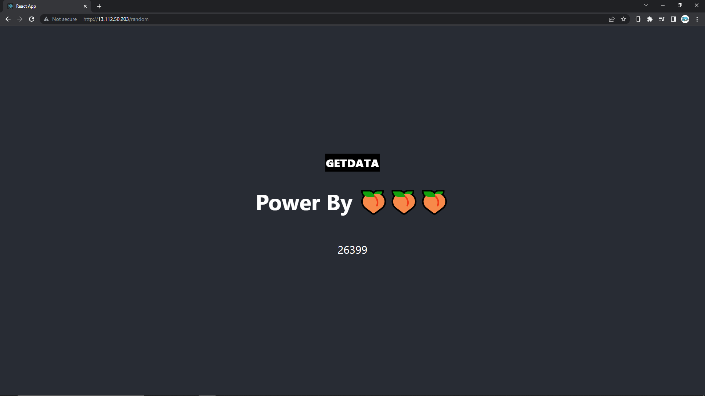
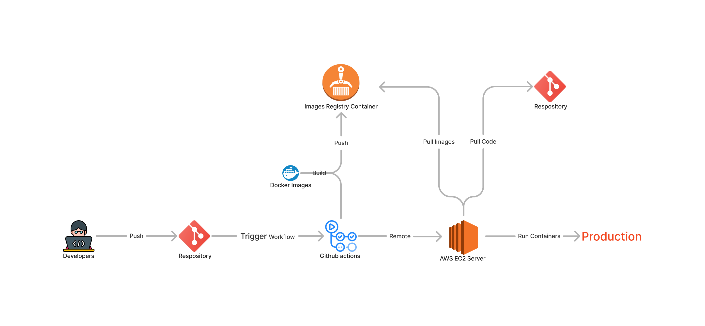
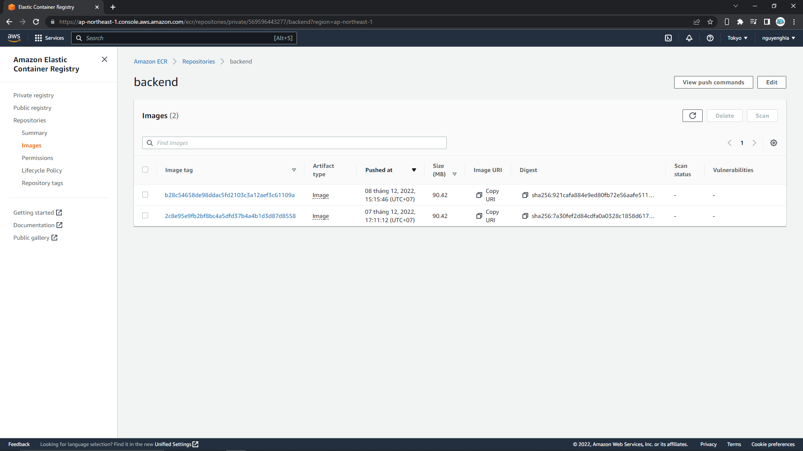
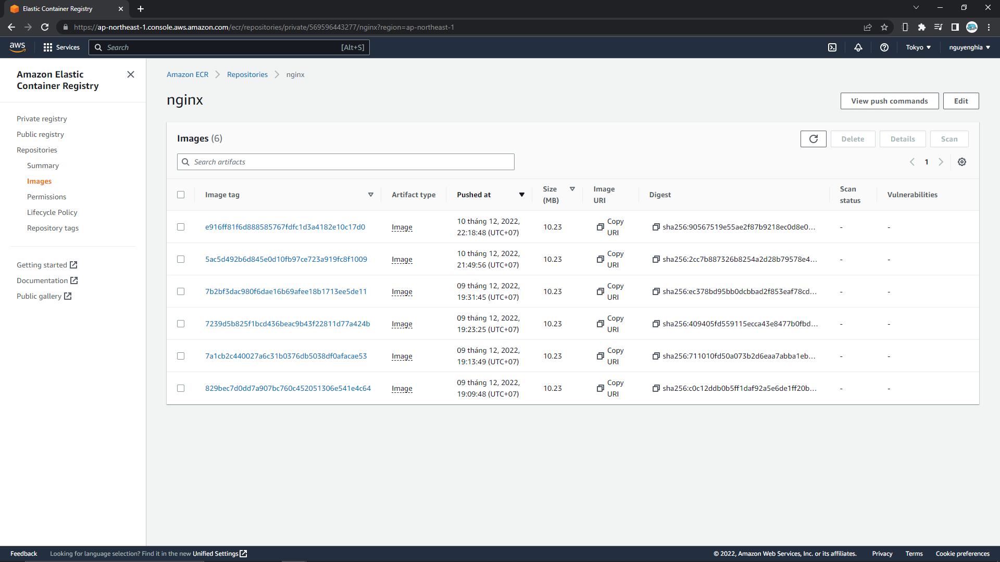
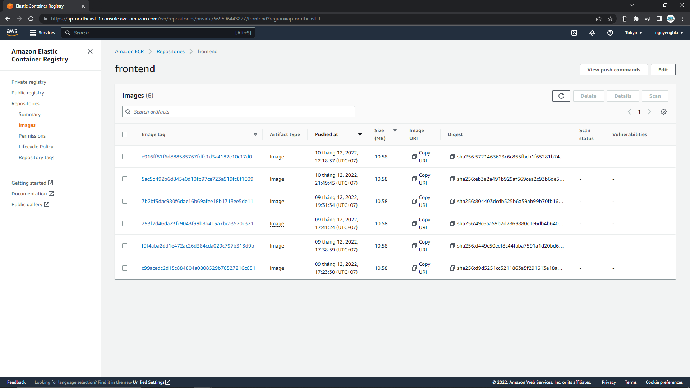
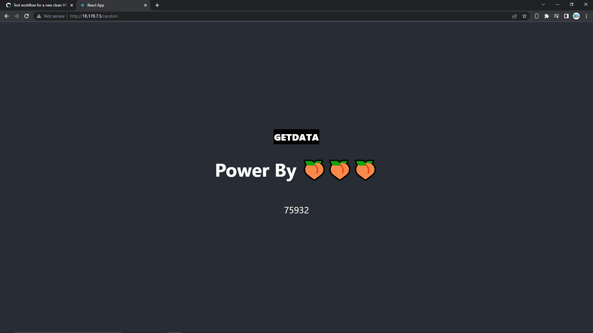

# Báo Cáo Tuần 3

Tuần làm việc thứ 3, nhóm tập trung việc nghiên cứu về github actions. Cùng với đó áp dụng github actions để tự động hóa quá trình deploy.

## Thực hiện deploy thủ công

Deploy thủ công ứng dụng lên một VPS(Cụ thể là EC2 của AWS).

Hình Ảnh về quá trình :

Thực hiện clone repo từ github và cài đặt docker sau đó chạy các build các images và chạy các containers.
Hình ảnh khi thực hiện **docker compose up**

Thấy các images đã được build và các containers đã được khởi động.

Kết quả nhận được : đã chạy được các containers và truy cập được web thông quá IP

## Github actions và tự động quá trình deploy

Github actions là một nền tảng để tự động hóa quá trình build,test, và deploy ứng dụng.
Các khái niệm trong github actions:

- event : một sự kiện xảy ra với repo, ví dụ : mở pull request, push , ..[xem thêm](https://docs.github.com/en/actions/using-workflows/events-that-trigger-workflows)
- workflow : quy trình tự động có thể config được, sẽ chạy các job được config. sẽ kích hoạt khi một event được chỉ định xảy ra.
- job : các step thực hiện một công việc nào đó. Các job này sẽ được thực hiện trên một server(thông thường được github cung cấp).
- Và khá nhiều khái niệm khác [Xem Thêm](https://docs.github.com/en/actions/learn-github-actions/understanding-github-actions).

### Quá Trình tự động deploy

**Workflow Diagram**

[Workflow File](https://github.com/quanduongduc/se2022-15.3/blob/main/.github/workflows/deploy.yml)

Workflow bao gồm 2 quá trình chính :

- Build : build các docker images và push chúng lên Registry(AWS ECR sẽ được sử dụng trong Project này)
- Deploy :

  1. Thực hiện remote VPS
  1. Chạy câu lệnh install và update các dependency trên VPS. OS được sử dụng trong project : Ubuntu Server 22.04 LTS (HVM)(64-bit (x86))
  1. Clone code từ github
  1. Chạy các containers (**docker compose up**)

Check workflow running tại : [Actions](https://github.com/quanduongduc/se2022-15.3/actions)

Các image đã được push lên registry :

Kết quả :

### Notes

- Cần Clone repo nên cần setup deploy key cho github : [hướng dẫn](https://docs.github.com/en/developers/overview/managing-deploy-keys)
- Cần remote VPS nên cần store credentials vào actions secret : [setup actions secret](https://docs.github.com/en/actions/security-guides/encrypted-secrets), credentials :

  - hostname : tên máy chủ (hiện tại sử dụng IPv4 của VPS)
  - username : username của OS (mặc định trong Ubuntu Server sử dụng trong project là **ubuntu**)
  - key : private sshkey, với ec2 có thể sử dụng trực tiếp key_pair

- Cần sử dụng ECR nên phải store **account access credentials** của aws vào actions secret : [hướng dẫn](https://docs.aws.amazon.com/powershell/latest/userguide/pstools-appendix-sign-up.html)
